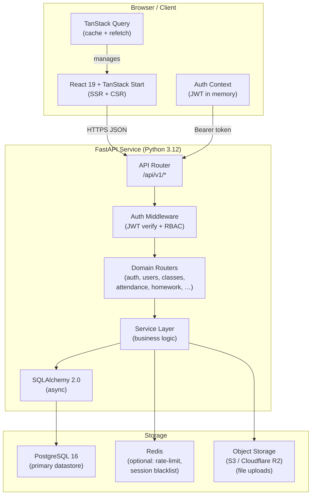
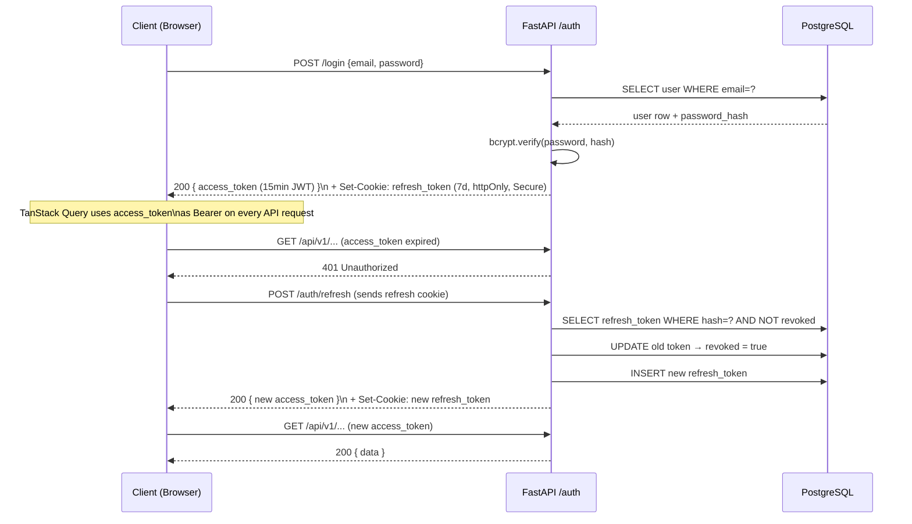
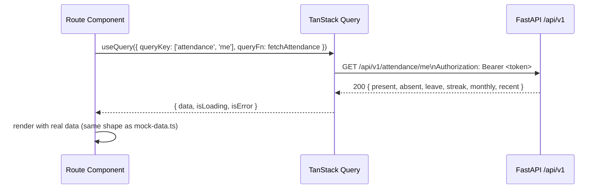

# Design Document: Backend API — Scholarly / EduConnect

## Overview

Scholarly currently runs entirely on hardcoded mock data in `src/lib/mock-data.ts` with a client-side auth context. This design replaces that with a production-grade FastAPI + PostgreSQL backend: a REST API that the existing React/TanStack frontend will call via TanStack Query. The backend is a standalone Python service; the frontend remains a TanStack Start SSR app. The two communicate over HTTP/HTTPS using JWT-authenticated JSON APIs.

The design covers: system architecture, entity-relationship model, API surface per domain, authentication strategy, and key design decisions. It is intentionally high-level — every table, route, and contract here maps directly to features that already exist in the UI.

---

## System Architecture



### Deployment Topology

| Layer | Technology | Notes |
|---|---|---|
| Frontend | TanStack Start / Nitro | Deployed to Cloudflare Pages or Vercel |
| Backend API | FastAPI + Uvicorn + Gunicorn | Deployed to Railway, Render, or a VPS |
| Database | PostgreSQL 16 | Managed: Supabase, Neon, or Railway Postgres |
| Cache / Sessions | Redis | Optional for Phase 1; required for push notifications |
| File Storage | Cloudflare R2 / AWS S3 | Homework attachments, gallery photos, profile pics |
| Auth tokens | JWT (access + refresh) | Short-lived access tokens; refresh via httpOnly cookie |

---

## Entity-Relationship Overview

This is the logical grouping. Detailed column lists follow per domain.

```mermaid
erDiagram
    SCHOOL ||--o{ ACADEMIC_YEAR : has
    ACADEMIC_YEAR ||--o{ TERM : has
    SCHOOL ||--o{ CLASS : has
    CLASS }o--|| ACADEMIC_YEAR : "belongs to"

    USER ||--o{ STUDENT : "profile"
    USER ||--o{ TEACHER : "profile"
    USER ||--o{ PARENT : "profile"
    USER ||--o{ ADMIN : "profile"

    STUDENT }o--o{ PARENT : "guardian link"
    STUDENT ||--o{ ENROLLMENT : "enrolled in"
    CLASS ||--o{ ENROLLMENT : "has students"

    TEACHER ||--o{ TEACHING_ASSIGNMENT : "teaches"
    SUBJECT ||--o{ TEACHING_ASSIGNMENT : "taught via"
    CLASS ||--o{ TEACHING_ASSIGNMENT : "in class"

    STUDENT ||--o{ ATTENDANCE_RECORD : "has"
    CLASS ||--o{ ATTENDANCE_RECORD : "per class"

    TEACHER ||--o{ HOMEWORK : "assigns"
    CLASS ||--o{ HOMEWORK : "for class"
    SUBJECT ||--o{ HOMEWORK : "about subject"
    STUDENT ||--o{ SUBMISSION : "submits"
    HOMEWORK ||--o{ SUBMISSION : "receives"

    STUDENT ||--o{ GRADE : "receives"
    SUBJECT ||--o{ GRADE : "for subject"
    TERM ||--o{ GRADE : "in term"

    STUDENT ||--o{ FEE_TRANSACTION : "pays"
    CLASS ||--o{ FEE_STRUCTURE : "has"

    USER ||--o{ MESSAGE : "sends"
    MESSAGE }o--o{ MESSAGE : "thread (parent_id)"

    USER ||--o{ LEAVE_REQUEST : "applies"
    TEACHER ||--o{ LEAVE_REQUEST : "approves"

    SCHOOL ||--o{ CIRCULAR : "publishes"
    SCHOOL ||--o{ EVENT : "schedules"

    CLASS ||--o{ TIMETABLE_SLOT : "has"
    SUBJECT ||--o{ TIMETABLE_SLOT : "scheduled"

    LIBRARY_BOOK ||--o{ LIBRARY_ISSUE : "issued to"
    STUDENT ||--o{ LIBRARY_ISSUE : "borrows"

    SCHOOL ||--o{ TRANSPORT_ROUTE : "operates"
    TRANSPORT_ROUTE ||--o{ ROUTE_STOP : "has stops"
    STUDENT }o--|| ROUTE_STOP : "boards at"

    STUDENT ||--o{ ACHIEVEMENT : "earns"
    SCHOOL ||--o{ GALLERY_ALBUM : "has"
    GALLERY_ALBUM ||--o{ GALLERY_PHOTO : "contains"

    USER ||--o{ NOTIFICATION : "receives"
```

---

## Core Data Models

### Identity & Access

| Table | Key Columns | Notes |
|---|---|---|
| `users` | `id`, `email`, `password_hash`, `role` (enum: student/teacher/parent/admin), `is_active`, `created_at` | Single users table; role determines which profile table exists |
| `students` | `id`, `user_id FK`, `school_id FK`, `admission_no`, `roll_no`, `class_id FK`, `dob`, `blood_group`, `house`, `address`, `photo_url` | 1:1 with users |
| `teachers` | `id`, `user_id FK`, `school_id FK`, `employee_id`, `designation`, `department` | 1:1 with users |
| `parents` | `id`, `user_id FK`, `occupation`, `verified` | 1:1 with users |
| `admins` | `id`, `user_id FK`, `school_id FK`, `title` | 1:1 with users |
| `student_parent` | `student_id FK`, `parent_id FK`, `relation` (Father/Mother/Guardian) | M:M join |
| `refresh_tokens` | `id`, `user_id FK`, `token_hash`, `expires_at`, `revoked` | For token rotation |

### School Structure

| Table | Key Columns |
|---|---|
| `schools` | `id`, `name`, `address`, `logo_url`, `contact_email`, `contact_phone` |
| `academic_years` | `id`, `school_id FK`, `label` (e.g. "2025-26"), `start_date`, `end_date`, `is_current` |
| `terms` | `id`, `academic_year_id FK`, `label` (T1/T2/T3), `start_date`, `end_date` |
| `classes` | `id`, `school_id FK`, `academic_year_id FK`, `grade` (10), `section` (B), `name` ("Class 10-B"), `class_teacher_id FK → teachers`, `room` |
| `subjects` | `id`, `school_id FK`, `name`, `code`, `color_hex`, `icon` |
| `enrollments` | `id`, `student_id FK`, `class_id FK`, `academic_year_id FK`, `enrolled_at` | Unique per student + year |
| `teaching_assignments` | `id`, `teacher_id FK`, `subject_id FK`, `class_id FK`, `academic_year_id FK` | Who teaches what to whom |

### Academics

| Table | Key Columns |
|---|---|
| `homework` | `id`, `class_id FK`, `subject_id FK`, `teacher_id FK`, `title`, `description`, `assigned_date`, `due_date`, `max_marks` |
| `homework_resources` | `id`, `homework_id FK`, `file_url`, `file_name`, `file_size` |
| `submissions` | `id`, `homework_id FK`, `student_id FK`, `submitted_at`, `file_url`, `marks_obtained`, `status` (pending/submitted/graded/overdue), `feedback` |
| `grades` | `id`, `student_id FK`, `subject_id FK`, `term_id FK`, `marks_obtained`, `max_marks`, `grade_letter`, `remarks`, `teacher_id FK` |
| `subject_progress` | `id`, `student_id FK`, `subject_id FK`, `academic_year_id FK`, `chapters_completed`, `total_chapters`, `quizzes_done`, `dpp_done` | Denormalized progress cache |

### Attendance

| Table | Key Columns |
|---|---|
| `attendance_records` | `id`, `student_id FK`, `class_id FK`, `date`, `status` (present/absent/leave), `marked_by FK → teachers`, `marked_at` | Unique on `(student_id, date)` |

### Finance

| Table | Key Columns |
|---|---|
| `fee_structures` | `id`, `class_id FK`, `academic_year_id FK`, `label`, `amount`, `category` (tuition/development/transport/lab/exam) |
| `fee_transactions` | `id`, `student_id FK`, `label`, `amount`, `payment_method`, `status` (success/pending/failed), `reference_id`, `paid_at` |

### Communication

| Table | Key Columns |
|---|---|
| `messages` | `id`, `sender_id FK → users`, `recipient_id FK → users`, `subject`, `body`, `parent_id FK → messages` (threading), `sent_at`, `read_at` |
| `circulars` | `id`, `school_id FK`, `author_id FK → users`, `title`, `body`, `category`, `pinned`, `published_at`, `audience` (all/teachers/parents/students) |

### Scheduling

| Table | Key Columns |
|---|---|
| `timetable_slots` | `id`, `class_id FK`, `subject_id FK`, `teacher_id FK`, `day_of_week` (0-5 Mon-Sat), `period_no`, `start_time`, `end_time`, `academic_year_id FK` |
| `events` | `id`, `school_id FK`, `title`, `event_date`, `event_type` (Holiday/Exam/Event/Meeting/PTM), `description`, `all_day` |
| `leave_requests` | `id`, `student_id FK`, `from_date`, `to_date`, `reason`, `status` (pending/approved/rejected), `applied_on`, `reviewed_by FK → teachers`, `reviewed_at` |

### Library

| Table | Key Columns |
|---|---|
| `library_books` | `id`, `school_id FK`, `title`, `author`, `isbn`, `category`, `total_copies`, `available_copies` |
| `library_issues` | `id`, `book_id FK`, `student_id FK`, `issued_date`, `due_date`, `returned_date`, `fine_amount`, `fine_paid` |

### Transport

| Table | Key Columns |
|---|---|
| `transport_routes` | `id`, `school_id FK`, `route_no`, `driver_name`, `driver_phone`, `vehicle_no`, `attendant_name` |
| `route_stops` | `id`, `route_id FK`, `stop_name`, `stop_order`, `scheduled_time` |
| `student_transport` | `id`, `student_id FK`, `route_id FK`, `stop_id FK`, `academic_year_id FK` |
| `transport_live` | `id`, `route_id FK`, `lat`, `lng`, `eta_minutes`, `status` (en-route/at-stop/arrived), `updated_at` | Updated by driver app or GPS device |

### Content & Social

| Table | Key Columns |
|---|---|
| `achievements` | `id`, `student_id FK`, `title`, `category` (Academic/Sports/Debate/Discipline), `awarded_date`, `description` |
| `gallery_albums` | `id`, `school_id FK`, `title`, `cover_url`, `created_at` |
| `gallery_photos` | `id`, `album_id FK`, `photo_url`, `caption`, `uploaded_by FK → users`, `uploaded_at` |
| `notifications` | `id`, `user_id FK`, `type`, `title`, `body`, `read`, `created_at`, `action_url` |

---

## API Surface by Domain

All endpoints are prefixed `/api/v1`. Request/response bodies are JSON. Dates are ISO-8601 strings. Pagination uses `?page=1&page_size=20`.

### Authentication  `/api/v1/auth`

| Method | Path | Description | Auth |
|---|---|---|---|
| POST | `/login` | Email + password → access token + refresh token cookie | Public |
| POST | `/refresh` | Rotate access token using httpOnly refresh cookie | Cookie |
| POST | `/logout` | Revoke refresh token | Bearer |
| GET | `/me` | Return current user profile + role-specific data | Bearer |

### Users & Profiles  `/api/v1/users`

| Method | Path | Description | Roles |
|---|---|---|---|
| GET | `/students/{id}` | Full student profile | own, parent, teacher, admin |
| PATCH | `/students/{id}` | Update profile fields | admin |
| GET | `/teachers/{id}` | Teacher profile | teacher (own), admin |
| GET | `/parents/{id}` | Parent profile | parent (own), admin |

### Schools & Structure  `/api/v1/schools`

| Method | Path | Description | Roles |
|---|---|---|---|
| GET | `/{school_id}/classes` | List classes for current academic year | teacher, admin |
| GET | `/{school_id}/subjects` | All subjects | all |
| GET | `/{school_id}/academic-years` | List years; current flagged | all |
| GET | `/{school_id}/terms` | Terms for current year | all |

### Classes  `/api/v1/classes`

| Method | Path | Description | Roles |
|---|---|---|---|
| GET | `/{class_id}` | Class info + teacher + stats | teacher, admin |
| GET | `/{class_id}/students` | Roster with attendance %, CGPA, status, trend | teacher, admin |
| GET | `/{class_id}/subjects` | Subjects taught, teacher, avg score, periods/week | teacher, admin, student |
| GET | `/{class_id}/timetable` | Weekly timetable slots | all |

### Attendance  `/api/v1/attendance`

| Method | Path | Description | Roles |
|---|---|---|---|
| GET | `/me` | Current user's attendance summary + monthly + recent log | student |
| GET | `/student/{student_id}` | Same for a specific student | teacher, admin, parent (own child) |
| POST | `/class/{class_id}/mark` | Bulk mark attendance for a date `{date, records: [{student_id, status}]}` | teacher |
| GET | `/class/{class_id}/date/{date}` | Attendance sheet for a class on a date | teacher, admin |

### Homework  `/api/v1/homework`

| Method | Path | Description | Roles |
|---|---|---|---|
| GET | `/me` | Student's homework list with status | student |
| GET | `/class/{class_id}` | All homework for a class | teacher |
| POST | `/` | Create new homework assignment | teacher |
| PATCH | `/{id}` | Update homework | teacher |
| DELETE | `/{id}` | Delete homework | teacher, admin |
| POST | `/{id}/submit` | Student submits (multipart with optional file) | student |
| PATCH | `/{id}/submissions/{sub_id}/grade` | Grade a submission | teacher |
| GET | `/{id}/submissions` | All submissions for a homework | teacher |

### Grades & Reports  `/api/v1/reports`

| Method | Path | Description | Roles |
|---|---|---|---|
| GET | `/me` | Student's report: CGPA, rank, subjects, trend, remarks | student |
| GET | `/student/{student_id}` | Report for a specific student | teacher, admin, parent (own) |
| POST | `/grades` | Create/upsert grade record for a student + subject + term | teacher |
| GET | `/class/{class_id}/term/{term_id}` | Class-level grade summary | teacher, admin |

### Courses / Subject Progress  `/api/v1/courses`

| Method | Path | Description | Roles |
|---|---|---|---|
| GET | `/me` | Student's subjects with progress, quiz count, DPP count | student |
| PATCH | `/{subject_id}/progress` | Update chapter/quiz/DPP counts | student (own), teacher |

### Fees  `/api/v1/fees`

| Method | Path | Description | Roles |
|---|---|---|---|
| GET | `/me` | Student's fee summary: total, paid, due, next due date | student, parent |
| GET | `/student/{student_id}` | Same for a specific student | admin |
| GET | `/structure/{class_id}` | Fee category breakdown for the class | all |
| GET | `/transactions/me` | Transaction history | student, parent |
| POST | `/transactions` | Record a new payment (admin/payment gateway callback) | admin |

### Messages  `/api/v1/messages`

| Method | Path | Description | Roles |
|---|---|---|---|
| GET | `/threads` | All conversation threads for current user | all |
| GET | `/threads/{thread_id}` | All messages in a thread | all |
| POST | `/send` | Send a message `{recipient_id, subject, body, parent_id?}` | all |
| PATCH | `/{id}/read` | Mark message as read | all |

### Circulars  `/api/v1/circulars`

| Method | Path | Description | Roles |
|---|---|---|---|
| GET | `/` | List circulars (pinned first) — filtered by audience | all |
| GET | `/{id}` | Full circular content | all |
| POST | `/` | Publish a new circular | admin |
| PATCH | `/{id}` | Update (pin/unpin, edit body) | admin |
| DELETE | `/{id}` | Archive circular | admin |

### Calendar & Events  `/api/v1/events`

| Method | Path | Description | Roles |
|---|---|---|---|
| GET | `/` | List events, filterable by `?month=&year=&type=` | all |
| POST | `/` | Create event | admin |
| PATCH | `/{id}` | Update event | admin |
| DELETE | `/{id}` | Delete event | admin |

### Leave Requests  `/api/v1/leave`

| Method | Path | Description | Roles |
|---|---|---|---|
| GET | `/me` | Student's leave requests | student |
| POST | `/` | Submit a leave request | student |
| GET | `/pending` | All pending requests for teacher's class | teacher |
| PATCH | `/{id}/review` | Approve or reject `{status, notes}` | teacher, admin |

### Timetable  `/api/v1/timetable`

| Method | Path | Description | Roles |
|---|---|---|---|
| GET | `/class/{class_id}` | Weekly schedule grid | all |
| GET | `/teacher/{teacher_id}` | Teacher's weekly schedule | teacher |
| POST | `/` | Create timetable slot | admin |
| PATCH | `/{id}` | Update slot | admin |
| DELETE | `/{id}` | Remove slot | admin |

### Library  `/api/v1/library`

| Method | Path | Description | Roles |
|---|---|---|---|
| GET | `/me` | Student's issued books, overdue, reading history | student |
| GET | `/student/{id}` | Same for a specific student | admin |
| GET | `/books` | Catalogue search with `?q=&category=` | all |
| POST | `/issues` | Issue a book to a student | admin |
| PATCH | `/issues/{id}/return` | Mark book returned, calculate fine | admin |

### Transport  `/api/v1/transport`

| Method | Path | Description | Roles |
|---|---|---|---|
| GET | `/me` | Student's route + assigned stop + driver info | student, parent |
| GET | `/routes/{route_id}` | Route details with all stops | all |
| GET | `/routes/{route_id}/live` | Live location: lat, lng, eta, status | all |
| POST | `/routes/{route_id}/live` | Push location update (driver app / IoT device) | driver role or admin |
| GET | `/` | All routes (school-wide) | admin |

### Achievements  `/api/v1/achievements`

| Method | Path | Description | Roles |
|---|---|---|---|
| GET | `/me` | Student's achievements | student |
| GET | `/student/{id}` | Achievements for a student | teacher, admin, parent (own) |
| POST | `/` | Add an achievement | teacher, admin |
| DELETE | `/{id}` | Remove an achievement | admin |

### Gallery  `/api/v1/gallery`

| Method | Path | Description | Roles |
|---|---|---|---|
| GET | `/albums` | All albums (school-wide) | all |
| GET | `/albums/{id}/photos` | Photos in an album | all |
| POST | `/albums` | Create album | admin |
| POST | `/albums/{id}/photos` | Upload photo (multipart) | admin |
| DELETE | `/albums/{id}` | Delete album | admin |

### Notifications  `/api/v1/notifications`

| Method | Path | Description | Roles |
|---|---|---|---|
| GET | `/` | Current user's notifications (unread first) | all |
| PATCH | `/{id}/read` | Mark as read | all |
| PATCH | `/read-all` | Mark all read | all |
| DELETE | `/{id}` | Dismiss notification | all |

---

## Authentication Strategy

### JWT with Refresh Token Rotation



**Token specs:**
- Access token: HS256 JWT, 15 minute TTL, payload: `{sub: user_id, role, school_id, iat, exp}`
- Refresh token: 7-day TTL, stored as bcrypt hash in `refresh_tokens` table, sent as `httpOnly; Secure; SameSite=Strict` cookie
- On logout: refresh token is revoked in DB

### Role-Based Access Control (RBAC)

Four roles defined in the `users.role` enum. A FastAPI dependency `require_roles([...])` is applied per route:

| Role | Description | Access |
|---|---|---|
| `student` | Student user | Own data, class schedule, school-wide read (events, circulars, gallery) |
| `teacher` | Teacher / class teacher | Their class(es), mark attendance, assign/grade homework, approve leave |
| `parent` | Parent / guardian | Own child's data (read-only), messages, circulars |
| `school_admin` | Principal / admin staff | All data, publish circulars, manage events, full read |

**Parent-child scoping**: Parents can only access data for students linked via `student_parent`. This is enforced in service-layer queries, not just middleware.

**Multi-tenancy**: Every query scopes to `school_id` so the API can serve multiple schools from one deployment.

---

## Error Handling

All error responses use a consistent envelope:

```json
{
  "error": {
    "code": "NOT_FOUND",
    "message": "Student not found",
    "details": null
  }
}
```

Standard HTTP status codes: `400` validation, `401` unauthenticated, `403` forbidden (authenticated but not authorized), `404` not found, `422` Pydantic validation error (FastAPI default), `500` internal.

FastAPI exception handlers are registered globally for `HTTPException` and `RequestValidationError`.

---

## Key Design Decisions

**1. Single `users` table with profile tables per role**
Rather than one fat users table with nullable fields, a base `users` table holds auth credentials and role. Each role has its own profile table (`students`, `teachers`, `parents`, `admins`) joined via `user_id`. This keeps queries clean and avoids nullable columns for every role's unique fields.

**2. `academic_year_id` on enrollment and teaching assignments**
Classes repeat every year. Enrollments and teaching assignments are year-scoped so historical data is preserved without archiving. A `is_current` flag on `academic_years` makes "current year" queries simple.

**3. Denormalized `subject_progress` table**
Chapter/quiz/DPP progress doesn't have a natural event source — it's tracking state, not events. A dedicated `subject_progress` row per `(student, subject, year)` is simpler and faster to query than aggregating from a log table.

**4. Soft-delete with `is_active` on users; archive flag on circulars**
Hard deletes break foreign key chains and audit trails. Users are deactivated, not deleted. Circulars are archived.

**5. File uploads go to object storage, not the DB**
Homework attachments, gallery photos, and profile pictures are uploaded to S3/R2 and stored as URLs. The API returns pre-signed upload URLs for direct browser-to-storage uploads, keeping the API server stateless.

**6. Pagination default of 20, configurable via query params**
All list endpoints support `?page=&page_size=` (max 100). This keeps payloads small on mobile and matches TanStack Query's `useInfiniteQuery` pattern.

**7. Transport live location is poll-based in Phase 1**
Rather than WebSockets, the driver app (or admin) POSTs location updates to `/transport/routes/{id}/live`. The frontend polls every 15s via TanStack Query. Real-time WebSocket upgrade is deferred to a later phase.

**8. Notifications are pulled, not pushed, in Phase 1**
The notifications table is written to by backend triggers (on new circular, new homework, attendance marked). The frontend polls `/notifications` on page focus. Browser push notifications via Web Push API are a Phase 2 feature.

---

## Frontend Integration Pattern

The frontend replaces mock data imports with TanStack Query hooks. The pattern for each domain is:



A thin `src/lib/api-client.ts` module wraps `fetch` with base URL configuration and automatic `Authorization` header injection from the auth context. Each domain gets its own query file (e.g. `src/lib/queries/attendance.ts`) exporting typed query functions.

The mock data shapes in `mock-data.ts` directly inform the API response schemas — the goal is zero changes to UI rendering components; only the data source changes.

---

## Testing Strategy

### Backend

- **Unit tests** (pytest): Service layer functions with mocked DB session
- **Integration tests** (pytest + `httpx.AsyncClient`): Full request/response cycle against a test PostgreSQL DB (spun up with Docker or pytest-postgres)
- **Property-based tests** (Hypothesis): Fee calculation, attendance percentage computation, CGPA aggregation

### Frontend

- **Query mocking**: Existing component tests can mock TanStack Query responses instead of importing mock-data
- **Contract testing**: Zod schemas on the frontend validate API response shapes at runtime in development

---

## Dependencies

### Backend

| Package | Version | Purpose |
|---|---|---|
| fastapi | 0.115.x | Web framework |
| uvicorn[standard] | 0.32.x | ASGI server |
| sqlalchemy[asyncio] | 2.0.x | ORM (async) |
| asyncpg | 0.30.x | Async PostgreSQL driver |
| alembic | 1.14.x | Database migrations |
| pydantic | 2.x | Request/response validation |
| python-jose[cryptography] | 3.3.x | JWT encoding/decoding |
| passlib[bcrypt] | 1.7.x | Password hashing |
| python-multipart | 0.0.x | File upload support |
| boto3 | 1.35.x | S3/R2 file storage |
| redis | 5.x | Optional: rate limiting, token blacklist |
| pytest | 8.x | Test runner |
| hypothesis | 6.x | Property-based testing |
| httpx | 0.28.x | Async HTTP client for tests |

---

## Correctness Properties

*A property is a characteristic or behavior that should hold true across all valid executions of a system — essentially, a formal statement about what the system should do. Properties serve as the bridge between human-readable specifications and machine-verifiable correctness guarantees.*

### Property 1: Error Response Envelope Consistency

*For any* request to any endpoint that produces a 4xx or 5xx response, the response body SHALL contain a `detail` field (or an `error` object with `code` and `message`), regardless of the cause of the error or the endpoint being called.

**Validates: Requirement 1.4**

---

### Property 2: Token Expiry Claims

*For any* Access_Token issued by the Auth_Service, the `exp` JWT claim minus the `iat` JWT claim SHALL equal exactly 900 seconds (15 minutes). *For any* Refresh_Token issued by the Auth_Service, the corresponding expiry window SHALL equal exactly 604800 seconds (7 days).

**Validates: Requirements 3.4, 3.5**

---

### Property 3: Password Storage Security

*For any* plaintext password string submitted during user creation or password update, the value stored in the `users` table SHALL never equal the plaintext input, and SHALL verify correctly using `bcrypt.verify(plaintext, stored_hash)`.

**Validates: Requirement 3.3**

---

### Property 4: Authentication Guard — Invalid Tokens

*For any* protected endpoint and *for any* request that either omits the `Authorization` header, uses a malformed token string, or uses an expired Access_Token, the API SHALL return `401 Unauthorized`.

**Validates: Requirements 3.9, 3.10**

---

### Property 5: Logout Invalidates Refresh Token

*For any* authenticated session, after the session's Refresh_Token is submitted to `/auth/logout`, any subsequent attempt to call `/auth/refresh` with that same Refresh_Token SHALL return `401 Unauthorized`.

**Validates: Requirement 3.8**

---

### Property 6: Role-Based Access — Cross-User Ownership

*For any* resource owned by user A (e.g. a Teacher's private messages, a Student's attendance record), a request authenticated as user B with equal or lesser role and no ownership link SHALL return `403 Forbidden`. Specifically: a Teacher requesting another Teacher's private resources returns 403, and a Parent requesting a Student's data without a guardian link returns 403.

**Validates: Requirements 4.3, 4.4**

---

### Property 7: Circular Visibility Filtering

*For any* Circular with a `visible_to` audience list, *for any* authenticated user whose Role is NOT in that list, the Circular SHALL NOT appear in the response from `GET /api/v1/circulars`.

**Validates: Requirement 14.1**

---

### Property 8: Circular Ordering — Pinned Before Non-Pinned

*For any* set of Circulars returned from `GET /api/v1/circulars`, all Circulars where `pinned == true` SHALL appear before all Circulars where `pinned == false`, with both groups individually sorted by `date` descending.

**Validates: Requirement 14.5**

---

### Property 9: Attendance Summary Invariant

*For any* Student's attendance summary returned from `GET /api/v1/attendance/me`, the value of `total` SHALL equal `present + absent + leave`, and `attendancePct` on the student profile SHALL equal `round((present / total) * 100, 1)` when `total > 0`.

**Validates: Requirements 7.1, 5.1**

---

### Property 10: Duplicate Attendance Rejection

*For any* Student and *for any* calendar date, submitting an Attendance_Record for that (student, date) pair a second time SHALL return `409 Conflict`, regardless of the status value in the second submission.

**Validates: Requirement 7.6**

---

### Property 11: Fee Balance Invariant

*For any* Student's fee summary, the value of `paid` SHALL equal the sum of all `fee_transactions.amount` where `status == 'success'` for that student, and `due` SHALL equal `totalAnnual - paid`. These values SHALL be computed dynamically on every request.

**Validates: Requirements 11.1, 11.4**

---

### Property 12: CRUD Round-Trip — Create Then Fetch Returns Matching Data

*For any* domain resource created via a POST endpoint (homework assignment, leave request, report, timetable slot, calendar event, circular, achievement, transport route, library issue), a subsequent GET request for that resource SHALL return data that matches every field submitted in the creation request.

**Validates: Requirements 8.2, 9.1, 10.3, 12.3, 13.2, 14.2, 16.3, 17.2, 18.2, 19.3**

---

### Property 13: Delete Then Fetch Returns Empty

*For any* domain resource that has been deleted (homework DELETE, achievement DELETE, calendar event DELETE, circular soft-delete, library return), a subsequent GET request for that specific resource or for the list it belongs to SHALL NOT include the deleted item.

**Validates: Requirements 8.4, 13.4, 14.4, 17.3, 18.3**

---

### Property 14: Timetable Conflict Rejection

*For any* two Timetable_Slots with the same `class_id`, `day_of_week`, and `period_no`, the second creation attempt SHALL return `409 Conflict`, regardless of the subject or teacher assigned.

**Validates: Requirement 12.5**

---

### Property 15: Leave Request Status Lifecycle

*For any* Leave_Request in a terminal state (`approved` or `rejected`), any attempt to transition it to another state (cancel, re-approve, re-reject) SHALL return `409 Conflict`.

**Validates: Requirement 9.5**

---

### Property 16: Response Field Completeness

*For any* authenticated request to a domain summary endpoint (`/me` or equivalent), the response object SHALL contain all fields specified in the corresponding Pydantic_Schema and all fields present in the matching `mock-data.ts` export shape, with no required field omitted or null when the underlying data exists.

**Validates: Requirements 5.1, 6.1, 7.1, 8.1, 9.2, 10.1, 11.1, 12.1, 15.1, 16.1, 17.1, 18.1, 19.1, 21.1, 22.1, 24.1**

---

### Property 17: Request Validation — Missing Required Fields Return 422

*For any* POST or PATCH endpoint and *for any* request body that omits a required field or provides a value of the wrong type, the API SHALL return `422 Unprocessable Entity` with a validation error that references the specific invalid field by name.

**Validates: Requirement 23.1**

---

### Property 18: Response Serialisation — No Passwords Exposed

*For any* API response across all endpoints, the serialised JSON body SHALL NOT contain any field named `password`, `hashed_password`, `password_hash`, or any bcrypt hash string.

**Validates: Requirement 23.2**

---

### Property 19: Roster Filter Correctness

*For any* performance status filter value applied to `GET /api/v1/teachers/me/class?status=`, every Student object returned SHALL have a `performanceStatus` field exactly matching the filter value, and no Student with a different `performanceStatus` SHALL appear in the results.

**Validates: Requirement 21.3**

---

### Property 20: AI Session History Order

*For any* sequence of messages sent by a Student to `POST /api/v1/ai/chat`, a subsequent call to `GET /api/v1/ai/chat/history` SHALL return those messages in the order they were sent (chronological by sent timestamp), with each user message immediately followed by its corresponding assistant reply.

**Validates: Requirements 20.1, 20.2**

---

### Property 21: Foreign Key Integrity

*For any* attempt to insert a record that references a non-existent parent entity (e.g. a homework assignment referencing a non-existent `class_id` or `subject_id`), the database layer SHALL raise an integrity error and the API SHALL return `422 Unprocessable Entity` or `404 Not Found` without creating a partial record.

**Validates: Requirement 2.3**

---

### Property 22: Timestamp UTC Storage

*For any* record created or updated through the API, all timestamp fields stored in the database SHALL be in UTC (offset +00:00), regardless of the timezone of the client making the request.

**Validates: Requirement 2.4**
